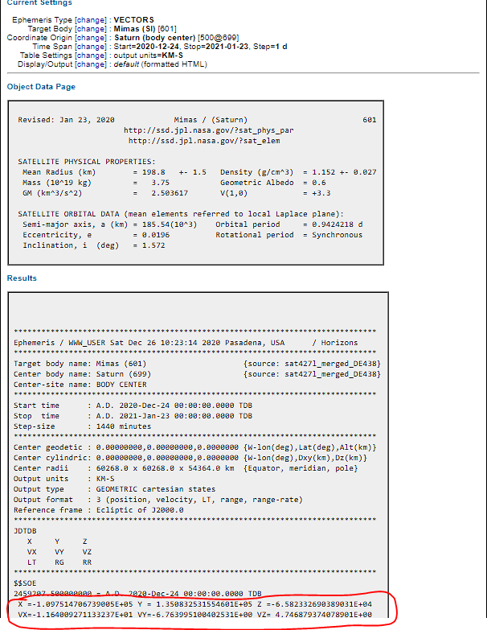
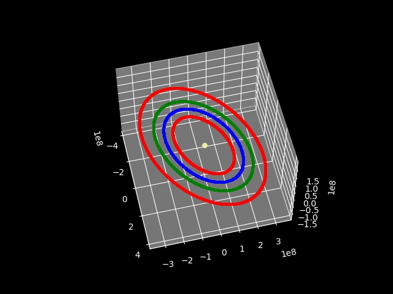
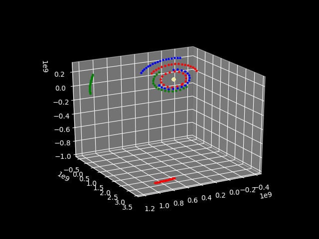
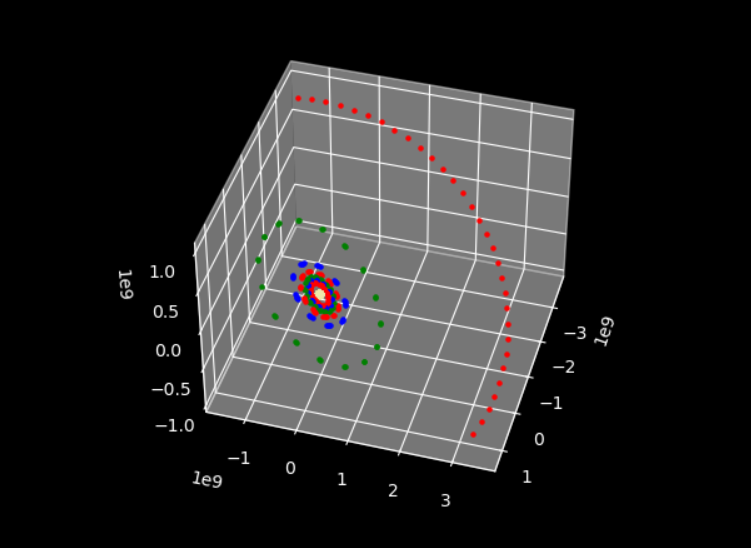
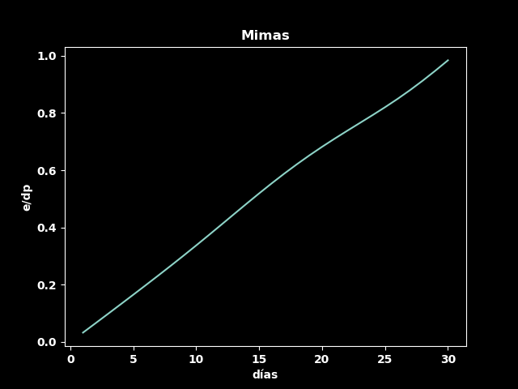
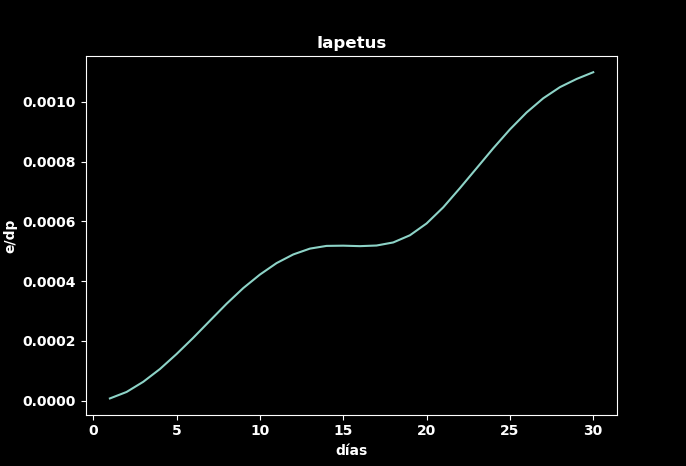
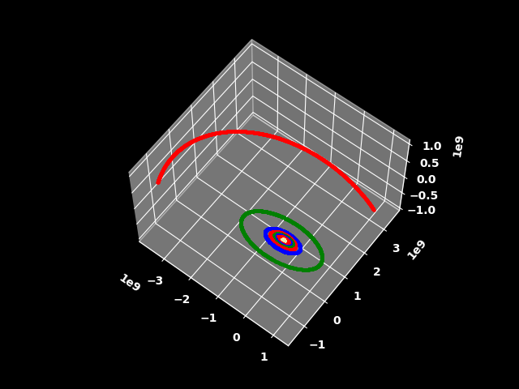
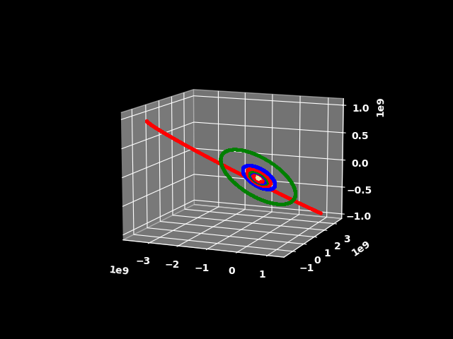
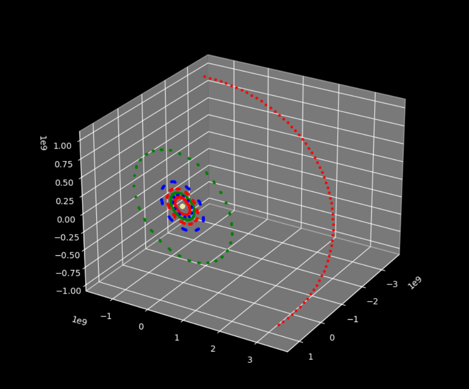

# Saturn's Moons
N-body model of Saturn and some of its moons.       
This is a new version of the model that stems from [this repository](https://github.com/itztli/n-body) whose author is [itztli](https://github.com/itztli).       
## Authors
Rafael Pérez - <tinoco21.30@gmail.com>    
Elena Bedolla - <maria.elena.bedolla.zamudio@gmail.com>      
Javier Navarro - <javojavojavojavo@gmail.com>
### Afiliation
                
We are BS IT students at UNAM (Universidad Nacional Autómoma de México) specifically at the ENES (Escuela Nacional de Estudios Superiores) Morelia.      
Degree name: Licenciatura en Tecnologías para la Información en Ciencias (IT in science)

## License
GNU General Public License v3.0
## Requirements
- python3      

The following python3 libraries:      

- matplotlib
- json      
- pandas
- numpy
- re
- datetime

Tested on Ubuntu20 and Windows10 in a conda environment.

## Execution
Clone git and run n-body.py

## Introduction
The n-body problem was a mathematical model suggested by Isaac Newton in 1687 to model the behavior of our planetary system, although this technique has been of great help in the modeling of any planetary orbit. Orbit modeling relies on creating mathematical models to simulate the motion of a massive body as it orbits another masive body due to gravity.

Saturn has 82 confirmed moons with diameter ranging  from a few meters to larger than that of the planet Mercury. Their orbits are different from those of their rings and their orbital periods also vary, for exampe that of Hyperion lasts 21 days and that of Mimas lasts only 24 hours. In this work we'll use the integrative numerical model of n-bodies using Newton's laws to model Saturn and some of its moons since we don't have the computational resources to model them all.
 

 
### Newton's Laws and position integration 
The formulas are written in black so it's advised to use a white background.
#### Newton's Second Law   
     

#### Universal Gravitational Law
    

The difference is that since we work in a 3-dimensional vector field, we have to add the vector u that will indicate the direction of the forces and F is now a vector as well. Additionally we divide by  instead of .       
#### N-bodies
The law of universal gravitation describes the force between 2 bodies, to generalize it to n-bodies, we can add all the forces of a body with the others and do so for each body.         
  
The sum is:
     
 
We substitute :     
      

We know that , so:     
         

We integrate and are left with velocity:      
         

As nothing depends on time, then:    
           
           
        
So then we know what's the velocity.      

We also know that , sustituimos:      
           

We integrate:     
       

Now we take v out of the integral although it does depend on time, what we assume is that the time jumps are so small that it has an insignificant effect for the purposes of the model, then:        
      
     
        

The calculated x is the change in position of a particle after a certain dt. Then, to calculate the new position of the particle, you just have to add the calculated change to the old position.

## Justification
Establish a precedent for a specific modeling of the moons of Saturn and at the same time use, discover or/and create and implement techniques that allow us to make an optimal model which will serve as a tool to know the Saturn system and know what will happen to it in the future.

## Objectives
- Disign a metric (or use an existing one) to know how much precision our model has

- Converge with the solution of the motion of the moons of Saturn
- Visualize the movement of some satellites of Saturn 

- Find the optimal parameters. Understand what effect different integration steps have on different masses of celestial bodies at different distances and with different velocities
- Optimize the code to be faster so that it can include more celestial bodies at the same time

## Methodology and implementation 
### Units
- Distance: meters
- Mass: kilograms
- Time: seconds      

G is defined as a global variable considering the above units.
### Classes and methods
#### Particle
The Particle class helps us to create particle objects, each one with its respective position, velocity, mass, trajectory and time (initialized at 0).
##### Particle Methods
- Getters are defined for: position, velocity, kinetic energy and for the trajectory.    
- A dt setter is defined. \*\*\*I think we don't use this method     
- computeR: Returns distance between 2 vectors. 
- computeU: Returns the substraction between 2 vectors (the direction of 'R').
- integrate: Update the position with the specified dt. \*\*\* I don't think we use this method either, it does the work of computeV, updateV and updatePosition, I don't think it is necessary
- computeV: Calculate the velocity of the particle taking into account the position and mass of another single body.
- updateV: Adds a new velocity (calculated in computeV) to the velocity of the particle updating it.
- updatePosition: Updates the position by adding the velocity multiplied by the same position. If the save variable is 'True', then it saves the position (in trajectory) for future graphing.

#### Potential
The Potential class puts all particle objects to work. It is initialized with a list of Particle objects, in this case Saturn and its moons, and with the dt.
##### Integrative method
It has 2 tasks:          
The first consists of iterating the particles all against all and updating their velocity taking into account each interaction. The second task is to update the position of all the particles using the previously updated velocity.
### Defining particles and parameters
To iterate the model, we must first define how many times it is going to be iterated and what size the dt is going to be in each iteration. We also have to keep track of the elapsed time to save the trajectory that includes time and position. Additionally we have to create particle objects (Saturn and its moons in this case), whose initial conditions of December 24, 2020 are stored in lunas.json.      

Now we can iterate.
### Plot
Using the list of positions (trajectory) of each particle, we plot each one with a different color and Saturn with a radius greater than that of its moons.
### Divergence Plot
To graph the divergence, we compare the calculations from our model against the data from the actual Horizons observations. For this we write in mimas_data.txt and iapetus_data.txt the daily positions of Mimas and Iapetus in an interval of 30 days. The read_horizon() funciton reads this data to later compare it with that generated by the model.

## Data source
### Example: Mimas and Saturn
The following image shows the initial conditions (position and velocity) of Mimas with respect to Saturn. Saturn being the reference frame, is the origin (position 0,0,0) in space and has no initial velocities (0,0,0). More data queries can be done on NASA's Horizons [here](https://ssd.jpl.nasa.gov/horizons.cgi).                 

## Tests
We start with the parameters proposed in the original work: _dt = 1_ and _lenTime_ of 1 month. 
### 1: 5 bodies, dt= 0.5 and 3 months of modeling (minutes in execution)
The plot took approximately 4 hours. Later we did tests with larger dts to decrease the execution and graphing time. Note that we are plotting points, but they are so close together that they look like lines.           

### 2: With a few hours of modeling (+ minutes in execution), we realized that with dt = 1 it does converge  
Now we included the 8 bodies and modeled less time. The tests where successful, but the execution time was increased.      

### To try to optimize a bit and make the graph less heavy, we decided to graph fewer points for each body.
We graph 60 points for each body, that is, we save the positions of each particle every (1,296,000 ÷ 60) iterations and then we graph them, with 1,296,000 being the total iterations in 30 days of modeling and dt = 2.       

## Results
After several more tests, we found that dt = 2 gave us the fastest results without sacrificing convergence. 8 bodies are included in the modeled system: Saturn, Mimas, Enceladus, Tethys, Dione, Rhea, Titan and Iapetus. The modeled time interval is 30 days: December 24, 2020 to January 23, 2021. The total execution time was approximately 10 minutes.

### Divergence plot (using Mimas and Iapetus)
- X axis: _days_ 
- Y axis: _e/dp_, where _e_ is the error in meters and _dp_ is the average distance from the satellite to Saturn.     

The error (divergence) is calculated with the Euclidean distance between real measurements of position (from Horizons) of each month (30 measurements) and those generated with this model. The calculation of the error was made using only the positions of Mimas and those of Iapetus.         

#### Mimas
        
It turns out that Mimas does not converge, wich was very strange to us because the graph shows that Mimas deviates too much, and our dotted plots do not show such extreme disturbances (Of 100%!). After several tests we saw that Mimas was lagging in each iteration, as if it were moving in slow motion on the correct path. That is why it went unnoticed in the testing stage, the error was hidden.  

#### Iapetus
         
It occurred to us to measure the divergence of Iapetus, since unlike Mimas, which has the shortest (and narrowest) orbital period of 0.9 days, this one has the longest of 79 days. It diverges much less, it does not even reach  0.01 e/dp.
### Orbits visualization

       

           
In this image it is observed that the orbits of the Moons of saturn are not all in the same plane.

## Conclusions
We satisfactorily met the objectives.     

We designed a metric to evaluate our model, which consisted of comparing its predictions with real measurements. And although the convergence results of the model were mixed, we realized the possibility that in the modeling of a system some bodies converge and others do not. We did many more experiments with smaller dt's (eg 0.25) but we did not see any improvement. 
> #### Mimas divergence hypothesis
> We believe that a much smaller dt is necessary to converge with the solution of much narrower orbits like Mimas. The 'motion' of each particle in the model from one dt to another is straight, the smallness of dt makes the motion appear curved. The idea is that Mimas's orbit is so small that the dt no longer apperars to be that small to it, so the modeled orbit starts to look more like a polygon than a curve. Each dt the particle advances too much and for the next dt it has to correct the trajectory a lot, leaving a 'peak' outside the real orbit, with the iterations the peaks accumulate and the particle is lagging behind because it is traveling further (passing by the peaks). However, at the moment we do not have enough evidence to affirm it. The question of how to model a system whose bodies need very different dt's to converge naturally arises.    

We were able to consistently visualize the orbits of Saturn's moons.

We found the optimal dt at least for Iapetus, starting from the dt = 1 proposed in the work on which this one was based.

We reduced the number of points to plot on the plot, making it much more efficient.

We were able to experience how quickly the resources to execute the code and visualize the plot increase as we increase the number of particles and the time to model, hence the importance of choosing the optimal dt to reduce operations by orders of magnitude.     

We need to keep doing experiments.
## Bibliography
- Victor de la Luz, 2021 n-body     
https://github.com/itztli/n-body
- JPL. 2020. JPL Solar System Dynamics HORIZONS Web-Interface CA, USA. Dataset accessed    
[2020-12-24] at https://ssd.jpl.nasa.gov/horizons.cgi
